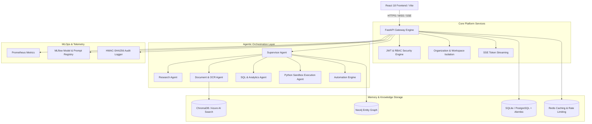
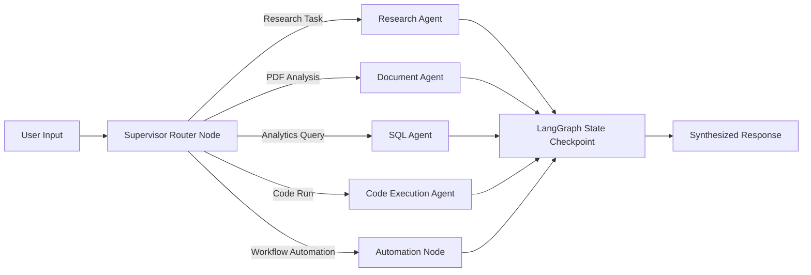

# Athena AI Enterprise SaaS Platform — Complete Architecture & Sprint Analysis

> **Author / Maintainer:** Harish Robin H  
> **System Version:** Athena AI v1.0 Enterprise Edition  
> **Repository:** [athena-ai](https://github.com/harishrobin11/athena-ai)  

---

## Executive Summary & System Overview

**Athena AI** is an enterprise-grade, multi-tenant Agentic AI platform designed to deliver secure, scalable, and intelligent AI capabilities. It combines **Retrieval-Augmented Generation (RAG)**, **Multi-Agent Orchestration (LangGraph)**, **Knowledge Graphs (Neo4j)**, **Hybrid Vector Search**, **Enterprise SaaS Controls**, and **Real-Time Analytics**.

---

## 🛠️ Technology Stack

| Domain | Technology / Library | Purpose |
| :--- | :--- | :--- |
| **Backend Framework** | [FastAPI](file:///Users/harishrobinh/Desktop/p/athena-ai/app/main.py) | High-performance async REST API, OpenAPI docs, and SSE streaming gateway |
| **Frontend UI** | React 18, Vite, Tailwind CSS, Recharts | Modern enterprise dashboard, chat interface, workflow builder |
| **Agentic Framework** | LangGraph, LangChain | State-machine graph execution, hierarchical supervisor-agent orchestration |
| **Vector Search** | ChromaDB / Azure AI Search | Dense embedding retrieval, hybrid search, tenant-isolated vector collections |
| **Knowledge Graph** | Neo4j, Cypher | Graph RAG, entity linking, semantic relationship traversal |
| **Relational Database** | SQLite / PostgreSQL + Alembic | Multi-tenant schema, organizations, users, workspace metadata, billing |
| **Caching & Pub/Sub** | Redis | API response caching, rate limiting, session storage, WebSocket pub/sub |
| **Background Tasks** | Celery + Redis | Asynchronous OCR, document parsing, report generation |
| **Monitoring & MLOps** | Prometheus, Grafana, MLflow, OpenTelemetry | System performance, token tracking, prompt versioning, metrics |
| **Security & Compliance** | PyJWT, Passlib (Bcrypt), HMAC-SHA256 | RBAC, OIDC/SSO integration, tamper-evident audit logging, PII redaction |

---

## 🚀 Sprint-by-Sprint Implementation Analysis (Phase 1 to Phase 7)

---

### PHASE 1 — Foundation Platform (Sprints 1 – 8)

#### Sprint 1: Project Foundation & Core Configuration
* **Goal**: Establish the base FastAPI service, environment management, and dependency injection setup.
* **Key Deliverables**:
  * Config management using `pydantic-settings` ([app/config.py](file:///Users/harishrobinh/Desktop/p/athena-ai/app/config.py)).
  * Centralized logging setup with structured JSON handlers ([app/core/logger.py](file:///Users/harishrobinh/Desktop/p/athena-ai/app/core/logger.py)).
  * Dockerization foundation ([Dockerfile](file:///Users/harishrobinh/Desktop/p/athena-ai/Dockerfile)).
* **Verification**: Standard health check endpoint `/` returning status `online`.

#### Sprint 2: Authentication & User Management
* **Goal**: Implement secure user registration, password hashing, JWT token issue/refresh, and session state.
* **Key Deliverables**:
  * Bcrypt password hashing & JWT generation ([app/auth/security.py](file:///Users/harishrobinh/Desktop/p/athena-ai/app/auth/security.py)).
  * FastAPI auth dependency injection ([app/auth/dependencies.py](file:///Users/harishrobinh/Desktop/p/athena-ai/app/auth/dependencies.py)).
  * User models & SQLAlchemy schemas ([app/memory/database.py](file:///Users/harishrobinh/Desktop/p/athena-ai/app/memory/database.py)).

#### Sprint 3: Document Management & File Ingestion
* **Goal**: Enable uploading, storing, parsing, and extracting metadata from enterprise PDFs and text documents.
* **Key Deliverables**:
  * PDF loading using PyPDF/Unstructured ([app/rag/loader.py](file:///Users/harishrobinh/Desktop/p/athena-ai/app/rag/loader.py)).
  * Document metadata extraction and validation service ([app/services/document_service.py](file:///Users/harishrobinh/Desktop/p/athena-ai/app/services/document_service.py)).

#### Sprint 4: Enterprise RAG & Vector Storage
* **Goal**: Implement document chunking, embedding generation, and vector index storage using ChromaDB.
* **Key Deliverables**:
  * Recursive text splitter ([app/rag/splitter.py](file:///Users/harishrobinh/Desktop/p/athena-ai/app/rag/splitter.py)).
  * Embedding model interface using SentenceTransformers/OpenAI ([app/rag/embedder.py](file:///Users/harishrobinh/Desktop/p/athena-ai/app/rag/embedder.py)).
  * ChromaDB vector store integration ([app/rag/vector_store.py](file:///Users/harishrobinh/Desktop/p/athena-ai/app/rag/vector_store.py)).

#### Sprint 5: Conversation Engine & Chat Persistence
* **Goal**: Build chat message state management, SQLite message history, and conversation search.
* **Key Deliverables**:
  * Chat history persistence service ([app/memory/conversation_store.py](file:///Users/harishrobinh/Desktop/p/athena-ai/app/memory/conversation_store.py)).
  * Full-text search over past user conversations ([app/tools/search_memory.py](file:///Users/harishrobinh/Desktop/p/athena-ai/app/tools/search_memory.py)).

#### Sprint 6: Real-Time SSE Token Streaming
* **Goal**: Enable Server-Sent Events (SSE) for token-by-token LLM output streaming to client interfaces.
* **Key Deliverables**:
  * Async generator SSE response pipeline ([app/api/v1/agent.py](file:///Users/harishrobinh/Desktop/p/athena-ai/app/api/v1/agent.py)).
  * Connection cancellation & heartbeat handling.

#### Sprint 7: Hybrid Search & Citation Engine
* **Goal**: Combine vector similarity search with metadata filtering and source document citation tracking.
* **Key Deliverables**:
  * Multi-query retriever ([app/rag/retriever.py](file:///Users/harishrobinh/Desktop/p/athena-ai/app/rag/retriever.py)).
  * Source snippet formatting & metadata citation payload generation.

#### Sprint 8: Production API Gateway & Swagger Specs
* **Goal**: Consolidate routers into unified FastAPI app with OpenAPI specifications and validation exception handling.
* **Key Deliverables**:
  * OpenAPI custom tags and interactive docs (`/api/docs`) ([app/main.py](file:///Users/harishrobinh/Desktop/p/athena-ai/app/main.py)).
  * Global exception handlers & structured JSON error payloads.

---

### PHASE 2 — Enterprise AI Core (Sprints 9 – 16)

#### Sprint 9: Tool Registry Architecture
* **Goal**: Build modular tool definitions for calculators, web search, memory lookup, and document retrieval.
* **Key Deliverables**:
  * Extensible tool execution base ([app/tools/](file:///Users/harishrobinh/Desktop/p/athena-ai/app/tools/)).
  * Web search integration & duckduckgo/custom search wrapper ([app/tools/web_search.py](file:///Users/harishrobinh/Desktop/p/athena-ai/app/tools/web_search.py)).

#### Sprint 10: JSON Planning Engine
* **Goal**: Implement structured JSON action planner to decompose complex user prompts into step-by-step tool plans.
* **Key Deliverables**:
  * Prompt planner engine ([app/core/planner.py](file:///Users/harishrobinh/Desktop/p/athena-ai/app/core/planner.py)).
  * Tool selection logic & Pydantic action schema validation.

#### Sprint 11: Agent Executor Engine
* **Goal**: Execute multi-step reasoning loops (ReAct pattern) with fallback handling and max step limits.
* **Key Deliverables**:
  * Agent execution runtime ([app/core/agent_executor.py](file:///Users/harishrobinh/Desktop/p/athena-ai/app/core/agent_executor.py)).

#### Sprint 12: Semantic Vector Memory Engine
* **Goal**: Implement user-level long-term semantic memory storage to retrieve past user preferences and facts across sessions.
* **Key Deliverables**:
  * Vector memory index ([app/memory/conversation_vector_store.py](file:///Users/harishrobinh/Desktop/p/athena-ai/app/memory/conversation_vector_store.py)).

#### Sprint 13: Multi-Document Enterprise Search
* **Goal**: Enable filtering document searches across specific organizational departments and metadata tags.
* **Key Deliverables**:
  * Department-scoped vector queries ([app/services/document_service.py](file:///Users/harishrobinh/Desktop/p/athena-ai/app/services/document_service.py)).

#### Sprint 14: Context-Aware Conversation Intelligence
* **Goal**: Dynamic context window calculation and semantic memory ranking based on query relevance.
* **Key Deliverables**:
  * Context summarizer and token trimmer ([app/core/memory_prompt.py](file:///Users/harishrobinh/Desktop/p/athena-ai/app/core/memory_prompt.py)).

#### Sprint 15: Multimodal AI & OCR Ingestion
* **Goal**: Image understanding and vision OCR integration for scanned receipts, technical diagrams, and forms.
* **Key Deliverables**:
  * Multimodal service integration ([app/multimodal/vision.py](file:///Users/harishrobinh/Desktop/p/athena-ai/app/multimodal/vision.py)).
  * OCR parser module ([app/rag/ocr_engine.py](file:///Users/harishrobinh/Desktop/p/athena-ai/app/rag/ocr_engine.py)).

#### Sprint 16: Enterprise Upload & RAG Dashboard
* **Goal**: Provide administrative UI components for tracking vector storage usage, document counts, and upload progress.
* **Key Deliverables**:
  * React dashboard integration ([frontend/src/components/Dashboard.jsx](file:///Users/harishrobinh/Desktop/p/athena-ai/frontend/src/components/Dashboard.jsx)).

---

### PHASE 3 — Agentic AI Platform (Sprints 17 – 24)

#### Sprint 17: LangGraph State Machine Integration
* **Goal**: Migrate agent execution to stateful graph execution nodes, state channels, and checkpointing.
* **Key Deliverables**:
  * LangGraph engine integration ([app/services/agent_framework/engine.py](file:///Users/harishrobinh/Desktop/p/athena-ai/app/services/agent_framework/engine.py)).

#### Sprint 18: Hierarchical Supervisor Agent
* **Goal**: Build supervisor node that routes tasks dynamically to specialized sub-agents based on intent classification.
* **Key Deliverables**:
  * Supervisor agent router ([app/services/agent_framework/nodes/supervisor.py](file:///Users/harishrobinh/Desktop/p/athena-ai/app/services/agent_framework/nodes/supervisor.py)).

#### Sprint 19: Specialized Research Agent
* **Goal**: Autonomous research agent capable of web search, fact-checking, synthesis, and source verification.
* **Key Deliverables**:
  * Research agent implementation ([app/agents/research_agent.py](file:///Users/harishrobinh/Desktop/p/athena-ai/app/agents/research_agent.py)).

#### Sprint 20: Specialized Document & Knowledge Agent
* **Goal**: Deep document analysis agent for table understanding, structured metadata extraction, and multi-page summarization.
* **Key Deliverables**:
  * Document agent module ([app/agents/document_agent.py](file:///Users/harishrobinh/Desktop/p/athena-ai/app/agents/document_agent.py)).

#### Sprint 21: Text-to-SQL Analytics Agent
* **Goal**: Natural language to SQL translator with schema introspection and read-only execution safety controls.
* **Key Deliverables**:
  * SQL agent service ([app/agents/sql_agent.py](file:///Users/harishrobinh/Desktop/p/athena-ai/app/agents/sql_agent.py)).

#### Sprint 22: Code Agent & Execution Sandbox
* **Goal**: Python code generation, linting, error debugging, and safe isolated execution sandbox.
* **Key Deliverables**:
  * Code execution agent ([app/agents/code_agent.py](file:///Users/harishrobinh/Desktop/p/athena-ai/app/agents/code_agent.py)).

#### Sprint 23: Workflow Automation Agent
* **Goal**: Multi-step automated task sequence engine with API invocation capabilities.
* **Key Deliverables**:
  * Workflow automation engine ([app/services/automation/engine.py](file:///Users/harishrobinh/Desktop/p/athena-ai/app/services/automation/engine.py)).

#### Sprint 24: Multi-Agent Collaborative Execution
* **Goal**: Multi-agent collaboration loop where Research, Memory, and SQL agents collaborate in a unified graph graph workflow.
* **Key Deliverables**:
  * Collaborative graph runner ([app/services/agent_framework/graph.py](file:///Users/harishrobinh/Desktop/p/athena-ai/app/services/agent_framework/graph.py)).

---

### PHASE 4 — Enterprise SaaS (Sprints 25 – 32)

#### Sprint 25: Multi-Tenant Architecture & Workspace Isolation
* **Goal**: Data separation by Organization ID and Workspace ID across database queries and vector indexes.
* **Key Deliverables**:
  * Tenant context middleware ([app/api/organizations.py](file:///Users/harishrobinh/Desktop/p/athena-ai/app/api/organizations.py)).
  * Workspace isolation router ([app/api/workspaces.py](file:///Users/harishrobinh/Desktop/p/athena-ai/app/api/workspaces.py)).

#### Sprint 26: Organization & Department Management
* **Goal**: User invitations, department groupings, workspace creation, and member management APIs.
* **Key Deliverables**:
  * Organization schemas and routers.

#### Sprint 27: Granular Role-Based Access Control (RBAC)
* **Goal**: Enforce 5 enterprise roles: `Owner`, `Admin`, `Manager`, `Developer`, and `Viewer`.
* **Key Deliverables**:
  * Role check decorators & FastAPI security dependencies ([app/api/security.py](file:///Users/harishrobinh/Desktop/p/athena-ai/app/api/security.py)).

#### Sprint 28: Tiered Subscription Engine (Stripe Integration)
* **Goal**: Subscription plan enforcement (`Free`, `Pro`, `Business`, `Enterprise`) and Stripe webhook integration.
* **Key Deliverables**:
  * Billing router ([app/api/billing.py](file:///Users/harishrobinh/Desktop/p/athena-ai/app/api/billing.py)).

#### Sprint 29: Usage Metering & Quota Tracking
* **Goal**: Real-time tracking of token consumption, document storage limits, and API request quotas per tenant.
* **Key Deliverables**:
  * Usage meter middleware & DB tracking tables.

#### Sprint 30: Administrative Control Portal
* **Goal**: Admin dashboard for user role assignments, system health logs, and tenant subscription overviews.
* **Key Deliverables**:
  * Admin API router ([app/api/admin.py](file:///Users/harishrobinh/Desktop/p/athena-ai/app/api/admin.py)).

#### Sprint 31: Knowledge Base Collections & Versioning
* **Goal**: Document tag management, collections, department sharing permissions, and version tracking.
* **Key Deliverables**:
  * Knowledge router ([app/api/knowledge.py](file:///Users/harishrobinh/Desktop/p/athena-ai/app/api/knowledge.py)).

#### Sprint 32: Enterprise Template Marketplace
* **Goal**: Sharing and deploying custom agent templates, prompt presets, and workflow automation blueprints.
* **Key Deliverables**:
  * Marketplace router ([app/api/marketplace.py](file:///Users/harishrobinh/Desktop/p/athena-ai/app/api/marketplace.py)).

---

### PHASE 5 — Cloud & MLOps (Sprints 33 – 40)

#### Sprint 33: Production Dockerization & Multi-Stage Builds
* **Goal**: Optimized, small-footprint Docker images for FastAPI backend and Vite frontend with Nginx/Caddy reverse proxy.
* **Key Deliverables**:
  * Backend Dockerfile ([Dockerfile](file:///Users/harishrobinh/Desktop/p/athena-ai/Dockerfile)).
  * Frontend Dockerfile ([frontend/Dockerfile](file:///Users/harishrobinh/Desktop/p/athena-ai/frontend/Dockerfile)).
  * Reverse proxy configs ([nginx/nginx.conf](file:///Users/harishrobinh/Desktop/p/athena-ai/nginx/nginx.conf), [Caddyfile](file:///Users/harishrobinh/Desktop/p/athena-ai/Caddyfile)).

#### Sprint 34: Azure Cloud Infrastructure & Azure OpenAI
* **Goal**: Cloud deployment scripts for Azure App Service, Azure OpenAI model endpoints, and Azure Blob Storage.
* **Key Deliverables**:
  * Docker Compose setup ([docker-compose.yml](file:///Users/harishrobinh/Desktop/p/athena-ai/docker-compose.yml)).
  * Azure provider client ([app/providers/azure_openai.py](file:///Users/harishrobinh/Desktop/p/athena-ai/app/providers/azure_openai.py)).

#### Sprint 35: Enterprise Search via Azure AI Search
* **Goal**: Production alternative to ChromaDB using Azure AI Search for high-concurrency vector search.
* **Key Deliverables**:
  * Search abstraction layer.

#### Sprint 36: Redis Caching & Rate Limiting Engine
* **Goal**: High-speed caching for query responses, session state storage, and rate limiting with `fastapi-limiter`.
* **Key Deliverables**:
  * Redis connection manager ([app/db/redis.py](file:///Users/harishrobinh/Desktop/p/athena-ai/app/db/redis.py)).
  * Cache management API router ([app/api/cache.py](file:///Users/harishrobinh/Desktop/p/athena-ai/app/api/cache.py)).

#### Sprint 37: PostgreSQL Database Migration & Alembic
* **Goal**: Migration from SQLite to PostgreSQL with Alembic database revision scripts.
* **Key Deliverables**:
  * Alembic migration environment ([alembic/](file:///Users/harishrobinh/Desktop/p/athena-ai/alembic/)).
  * Database migration configuration ([alembic.ini](file:///Users/harishrobinh/Desktop/p/athena-ai/alembic.ini)).

#### Sprint 38: CI/CD Pipeline & GitHub Actions Automation
* **Goal**: Automated testing, linting, Docker image building, and deployment workflows.
* **Key Deliverables**:
  * Continuous Integration pipeline ([.github/workflows/ci.yml](file:///Users/harishrobinh/Desktop/p/athena-ai/.github/workflows/ci.yml)).
  * Continuous Deployment pipeline ([.github/workflows/cd.yml](file:///Users/harishrobinh/Desktop/p/athena-ai/.github/workflows/cd.yml)).

#### Sprint 39: System Monitoring with Prometheus & Grafana
* **Goal**: Real-time telemetry, latency histograms, HTTP request metrics, and Grafana dashboard integration.
* **Key Deliverables**:
  * Prometheus configuration ([prometheus.yml](file:///Users/harishrobinh/Desktop/p/athena-ai/prometheus.yml)).
  * Prometheus metrics router ([app/api/v1/metrics.py](file:///Users/harishrobinh/Desktop/p/athena-ai/app/api/v1/metrics.py)).

#### Sprint 40: LLMOps, Prompt Versioning & MLflow Evaluation
* **Goal**: Track LLM experiment runs, prompt versions, latency metrics, and output quality evaluations via MLflow.
* **Key Deliverables**:
  * MLflow tracking database (`mlruns.db`).

---

### PHASE 6 — Enterprise Intelligence (Sprints 41 – 48)

#### Sprint 41: Advanced Receipt & Invoice OCR Engine
* **Goal**: Specialized document parsing for structured key-value extraction from financial invoices and forms.
* **Key Deliverables**:
  * OCR engine module ([app/rag/ocr_engine.py](file:///Users/harishrobinh/Desktop/p/athena-ai/app/rag/ocr_engine.py)).
  * Document AI API ([app/document_ai/parser.py](file:///Users/harishrobinh/Desktop/p/athena-ai/app/document_ai/parser.py)).

#### Sprint 42: Knowledge Graph Integration (Neo4j Graph RAG)
* **Goal**: Entity extraction and graph database integration for multi-hop semantic relationship queries.
* **Key Deliverables**:
  * Neo4j driver connection manager ([app/db/neo4j.py](file:///Users/harishrobinh/Desktop/p/athena-ai/app/db/neo4j.py)).

#### Sprint 43: Hybrid Search 2.0 & Cross-Encoder Re-Ranking
* **Goal**: Combine sparse BM25 keyword matching with dense vector retrieval, re-ranked via Cross-Encoder models.
* **Key Deliverables**:
  * Re-ranking pipeline ([app/rag/retriever.py](file:///Users/harishrobinh/Desktop/p/athena-ai/app/rag/retriever.py)).

#### Sprint 44: Enterprise NLP Engine
* **Goal**: Named Entity Recognition (NER), text classification, sentiment detection, and automated summarization.
* **Key Deliverables**:
  * NLP service engine ([app/services/nlp_service.py](file:///Users/harishrobinh/Desktop/p/athena-ai/app/services/nlp_service.py)).

#### Sprint 45: Prompt Engineering Studio
* **Goal**: Interactive prompt testing, version management, and response evaluation studio.
* **Key Deliverables**:
  * Prompt management interfaces.

#### Sprint 46: Safety & Compliance Guardrails
* **Goal**: Automatic PII (Personally Identifiable Information) redaction, prompt injection filtering, and toxicity checks.
* **Key Deliverables**:
  * Safety service engine ([app/services/safety_service.py](file:///Users/harishrobinh/Desktop/p/athena-ai/app/services/safety_service.py)).

#### Sprint 47: Enterprise API Hub
* **Goal**: Connectors for third-party enterprise tools including Slack, Microsoft Teams, Jira, and Salesforce.
* **Key Deliverables**:
  * Enterprise API Hub integrations ([app/services/integrations/api_hub.py](file:///Users/harishrobinh/Desktop/p/athena-ai/app/services/integrations/api_hub.py)).

#### Sprint 48: Drag-and-Drop Workflow Builder
* **Goal**: Interactive visual canvas engine for constructing multi-step automated agent workflows.
* **Key Deliverables**:
  * React Workflow Builder component ([frontend/src/components/WorkflowBuilder.jsx](file:///Users/harishrobinh/Desktop/p/athena-ai/frontend/src/components/WorkflowBuilder.jsx)).

---

### PHASE 7 — Production & Scale (Sprints 49 – 56)

#### Sprint 49: Modern React 18 Frontend
* **Goal**: Single Page Application built with React 18, Vite, Tailwind CSS, and Lucide icons replacing legacy UI.
* **Key Deliverables**:
  * Main application entry point ([frontend/src/App.jsx](file:///Users/harishrobinh/Desktop/p/athena-ai/frontend/src/App.jsx)).
  * Chat Interface component ([frontend/src/components/ChatInterface.jsx](file:///Users/harishrobinh/Desktop/p/athena-ai/frontend/src/components/ChatInterface.jsx)).

#### Sprint 50: Enterprise Analytics Dashboard 2.0
* **Goal**: Real-time visual dashboards showing token consumption, model response latency, and system load.
* **Key Deliverables**:
  * Performance dashboard ([frontend/src/components/PerformanceDashboard.jsx](file:///Users/harishrobinh/Desktop/p/athena-ai/frontend/src/components/PerformanceDashboard.jsx)).

#### Sprint 51: Real-Time WebSockets Notification System
* **Goal**: In-app notification bell and WebSocket event streamer for real-time background task updates.
* **Key Deliverables**:
  * Notifications API router ([app/api/notifications.py](file:///Users/harishrobinh/Desktop/p/athena-ai/app/api/notifications.py)).
  * React Notification Bell component ([frontend/src/components/NotificationBell.jsx](file:///Users/harishrobinh/Desktop/p/athena-ai/frontend/src/components/NotificationBell.jsx)).

#### Sprint 52: API Gateway & Microservice Routing
* **Goal**: Load balancing, dynamic route forwarding, CORS security, and unified microservice entry points.
* **Key Deliverables**:
  * FastAPI gateway configuration ([app/main.py](file:///Users/harishrobinh/Desktop/p/athena-ai/app/main.py)).

#### Sprint 53: Distributed Task Processing with Celery
* **Goal**: Offload heavy OCR, document chunking, and report generation tasks to background Celery workers.
* **Key Deliverables**:
  * Celery worker engine ([app/tasks/worker.py](file:///Users/harishrobinh/Desktop/p/athena-ai/app/tasks/worker.py)).

#### Sprint 54: Performance Optimization & Response Compression
* **Goal**: GZip middleware for responses > 1KB, sub-millisecond response timing headers (`X-Response-Time`), and dynamic memory caching.
* **Key Deliverables**:
  * Performance timing middleware ([app/main.py](file:///Users/harishrobinh/Desktop/p/athena-ai/app/main.py#L110-L118)).

#### Sprint 55: Enterprise Security, OIDC SSO & Tamper-Evident Audit Logging
* **Goal**: Azure Entra ID / OIDC SSO integration, cryptographic HMAC-SHA256 audit logs, and compliance reporting APIs.
* **Key Deliverables**:
  * Security & Compliance router ([app/api/security.py](file:///Users/harishrobinh/Desktop/p/athena-ai/app/api/security.py)).
  * React Security Dashboard ([frontend/src/components/SecurityDashboard.jsx](file:///Users/harishrobinh/Desktop/p/athena-ai/frontend/src/components/SecurityDashboard.jsx)).

#### Sprint 56: Athena AI v1.0 Production Launch & Final Certification
* **Goal**: End-to-end integration testing, performance benchmarking, security verification, and release launch.
* **Key Deliverables**:
  * Core health & system ready status ([app/main.py](file:///Users/harishrobinh/Desktop/p/athena-ai/app/main.py#L140)).
  * Final roadmap completion certification ([ROADMAP.md](file:///Users/harishrobinh/Desktop/p/athena-ai/ROADMAP.md#L719-L722)).

---

## Key File Reference Directory

| Feature Area | File Path |
| :--- | :--- |
| **API Entry Point** | [app/main.py](file:///Users/harishrobinh/Desktop/p/athena-ai/app/main.py) |
| **App Configuration** | [app/config.py](file:///Users/harishrobinh/Desktop/p/athena-ai/app/config.py) |
| **Agent State Machine** | [app/services/agent_framework/engine.py](file:///Users/harishrobinh/Desktop/p/athena-ai/app/services/agent_framework/engine.py) |
| **Supervisor Agent** | [app/services/agent_framework/nodes/supervisor.py](file:///Users/harishrobinh/Desktop/p/athena-ai/app/services/agent_framework/nodes/supervisor.py) |
| **Document RAG Vector Store**| [app/rag/vector_store.py](file:///Users/harishrobinh/Desktop/p/athena-ai/app/rag/vector_store.py) |
| **Knowledge Graph Driver** | [app/db/neo4j.py](file:///Users/harishrobinh/Desktop/p/athena-ai/app/db/neo4j.py) |
| **Redis Cache Manager** | [app/db/redis.py](file:///Users/harishrobinh/Desktop/p/athena-ai/app/db/redis.py) |
| **Celery Background Worker** | [app/tasks/worker.py](file:///Users/harishrobinh/Desktop/p/athena-ai/app/tasks/worker.py) |
| **Enterprise Security API** | [app/api/security.py](file:///Users/harishrobinh/Desktop/p/athena-ai/app/api/security.py) |
| **React Frontend App** | [frontend/src/App.jsx](file:///Users/harishrobinh/Desktop/p/athena-ai/frontend/src/App.jsx) |
